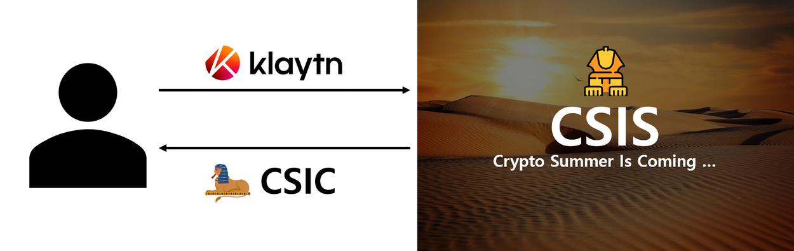
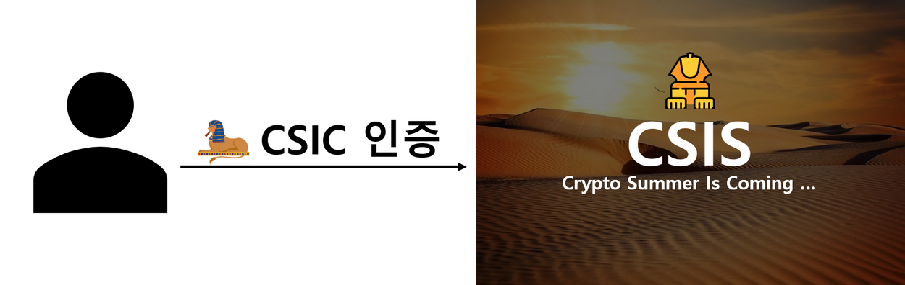
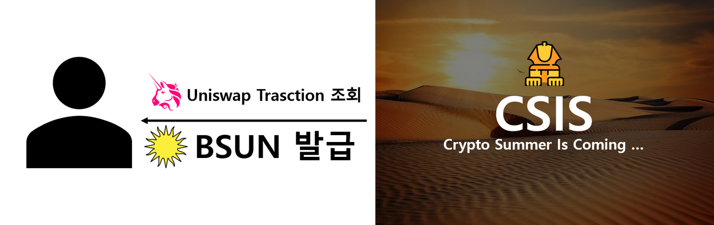
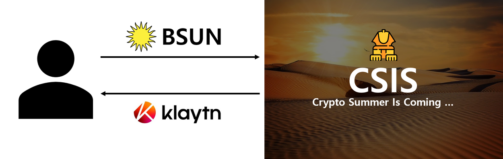
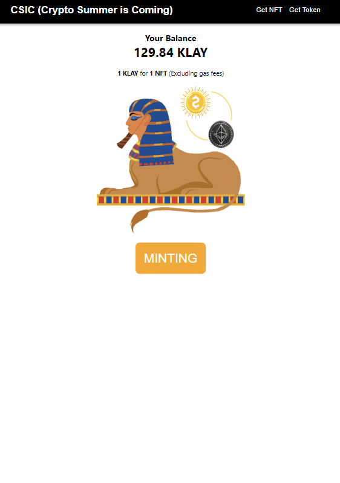
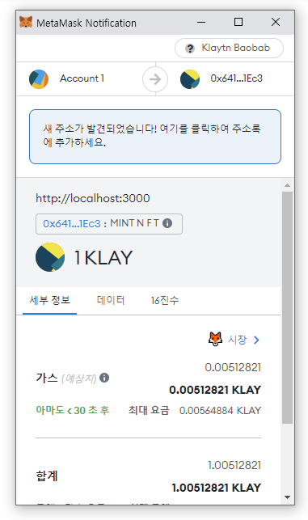
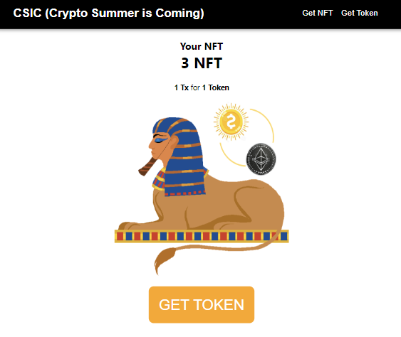
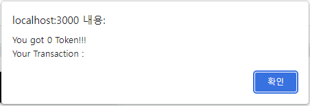

    <h1><b>CSIS : Crypto Summer Is Coming ...</b></h1>
    
     
     

    <b>[ Intoduce ]</b>
    <ul>
        <li>프로젝트 이름 : Crypto Summer Is Coming...</li>
        <li>프로젝트 목적 : </li>
        <ol>
            <li>dApp 프로젝트 구현.</li>
            <li>Smart Contract 이해.</li>
            <li>ERC-721 기반 CSIC NFT 발급.</li>
            <li>ERC-20 기반 BSUN Token 발급.</li>
            <li>Uniswap을 통한 BSUN Token과 Klaytn 교환.</li>
        </ol>
        <li>프로젝트 구현 :</li>
        <ul>
            <li>Client : React, Typescript, Ethers</li>
            <li>Server : NodeJS, Express, MySQL</li>
            <li>Blockchain : Solidity(ERC-20, ERC-721)</li>
        </ul>
    </ul>

     
    
<b>[ Member ]</b>

    <ul>
        <li>팀장 : 황수민 </li>
        <li>팀원 : 김기쁨 </li>
        <li>팀원 : 민성한 </li>
    </ul>
     

    

    
<b>[ Workflow ]</b>

    

        <h3><b>1. User가 Minting Page에서 Klaytn으로 NFT(CSIC) 구매.</b></h3>
        
          
    

    

        <h3><b>2. 구매한 NFT(CSIC) 인증.</b></h3>
        
          
    

    

        <h3><b>3. Uniswap Transaction 조회 후 BSUN Token 발급.</b></h3>
        
          
    

    

        <h3><b>4. Dex에서 BSUN Token과 Klaytn 교환.</b></h3>
        
          
    

     

    

    
<b>[ Function Description ]</b>

    <ul>
        <li><b>Explorer</b></li>
        <ul>
            <li>메타마스크 연동.</li>
            <li>Klaytn 보유량 확인.</li>
            <li>메타마스크 설치 페이지 Redirect.</li>
        </ul> 
        <li><b>NFT(CSIC)</b></li>
        <ul>
            <li>ERC-721 Solidity 배포 및 CSIC NFT 발급.</li>
            <li>Klaytn 잔액 부족 시 구매 페이지 Redirect.</li>
        </ul> 
        <li><b>Token(BSUN)</b></li>
        <ul>
            <li>CSIC NFT 보유량 확인.</li>
            <li>Uniswap Transaction 확인 (최신 1,000개).</li>
            <li>Transaction Valid 확인 및 발급량 설정.</li>
            <li>ERC-20 Solidity 배포 및 BSUN Token 발급.</li>
        </ul> 
        <li><b>Uniswap</b></li>
        <ul>
            <li>BSUN Token 보유량 확인.</li>
            <li>BSUN 및 Klaytn Uniswap 진행.</li>
        </ul>
    </ul>
     

    

    
<b>[ Screenshot ]</b>

    

        <h3><b>■ NFT(CSIC) Minting & Publish To User</b></h3>
        

            
            
        

          
    </dib>
    

        <h3><b>■ Token(BSUN) Minting & Publish To User</b></h3>
        
    
            
        

        

            
        

          
    </dib>

